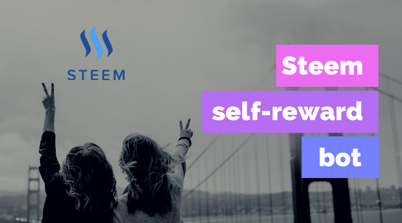

# Self-reward on Steem

## Overview
This script is created by [@antonsteemit](https://steemit.com/@antonsteemit), user can log in with their steem `posting_key`, and the script will automatically generate comments and vote on them. You can customize `voting weight` and `voting power threshold` to fit your needs, so that we can be sure that no voting power is wasted while we're asleep.



## Installation
* You need to have `nodejs` installed to run the script.

```
$ git clone https://github.com/antoncoding/steem-self-reward.git
$ npm install
```

## Configuration
Rename `config-example.json` to `config.json`:
```
$ mv config-example.json config.json
```
Set the options in `config.json`:
```
{
  "rpc_nodes": [
    "https://api.steemit.com",
    "https://rpc.buildteam.io",
    "https://steemd.minnowsupportproject.org",
    ],
  "account": "account_name",
  "posting_key": "private_posting_key",

  "target_author":"bidseption", // Info about target post you want to create your comments on
  "target_permlink":"2ttjue-we-re-promoting-following-tags-worldcup-fifa-paying-100-to-delegators",
  "parent_comment_content":"This is a comment created for self-reward.",
  "voting_power_threshold":10000, // create new comment and vote when 100% voting power reached.
  "voting_weight":10000, // Vote with 100% voting weight
}

```

## Run
```
$ node self-reward.js
```

## Donation:
I'll appreciate it if you want to buy me a cup of **bubble tea** :)
* Steem account: [@self-reward](https://steemit.com/@self-reward) or [@antonsteemit](https://steemit.com/@antonsteemit)
